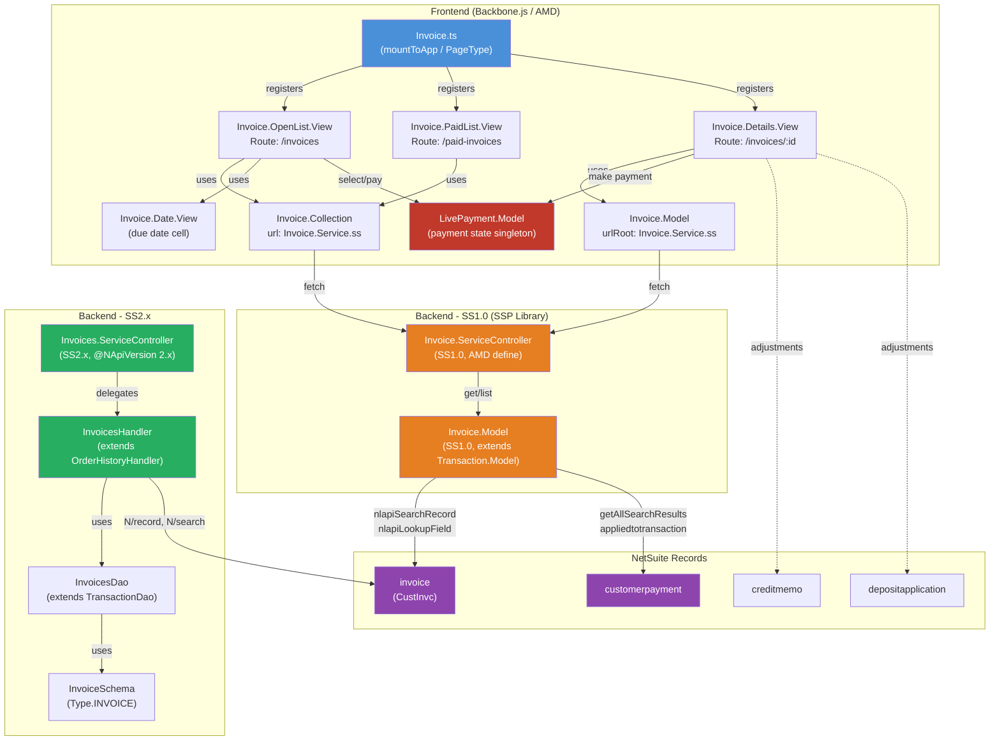

# Invoice Module

## Purpose

The Invoice module provides a complete customer-facing invoice management experience within the SuiteCommerce Advanced My Account portal. It allows logged-in customers to view, filter, sort, and pay their open invoices, as well as browse their paid invoice history. It integrates tightly with the **LivePayment** workflow for making payments and supports return authorization requests from invoice detail pages.

## Key Responsibilities

- **Open Invoice Listing** (`/invoices`) -- Displays all open (unpaid) invoices with selectable checkboxes for batch payment, filtering by due-date ranges (overdue, 7/30/60/90 days), sorting by due date/invoice date/number/amount due, and server-side pagination.
- **Paid Invoice Listing** (`/paid-invoices`) -- Displays paid-in-full invoices with sorting by close date/invoice date/number/amount, date-range filtering, and server-side pagination.
- **Invoice Detail** (`/invoices/:id`) -- Shows full invoice details including line items, billing address, sales rep info, payment terms, memo, summary (subtotal, discount, tax, shipping, handling, gift certificates), adjustments (payments, credit memos, deposit applications), and amount due. Supports PDF download, "Make a Payment" action, and "Request Return" when returnable lines exist.
- **Payment Integration** -- Open invoices can be individually or batch-selected; selection state is tracked via `LivePaymentModel.invoicesSelected`. Multi-currency payment validation prevents paying invoices in different currencies. Maximum simultaneous invoice payment count is configurable (default: 20).
- **Due Date Status Indicators** -- The `Invoice.Date.View` sub-view renders overdue flags, partially-paid badges, and unapproved-payment warnings inline in the open list.

## SuiteScript Version

| File | Version | Notes |
|------|---------|-------|
| `SuiteScript/Invoice.Model.js` | **SS1.0** | Uses `nlobjSearchColumn`, `nlobjSearchFilter`, `nlapiStringToDate`, `nlapiLookupField`, `Application.getAllSearchResults` |
| `SuiteScript/Invoice.ServiceController.js` | **SS1.0** | AMD `define()` pattern extending `ServiceController` |
| `Backend/SC/Invoices/Invoices.Handler.ts` | **SS2.x** | `@NApiVersion 2.x`, extends `OrderHistoryHandler` |
| `Backend/SC/Invoices/Invoices.ServiceController.ts` | **SS2.x** | `@NApiVersion 2.x`, extends `SCAServiceController` |
| `Backend/SC/Invoices/RecordAccess/Invoices.Dao.ts` | **SS2.x** | `@NApiVersion 2.x`, extends `TransactionDao` |
| `Backend/SC/Invoices/RecordAccess/Invoice.Schema.ts` | **SS2.x** | `@NApiVersion 2.x`, full schema definition for `Type.INVOICE` |

**Verdict: Mixed SS1.0 + SS2.x** -- The legacy SSP-library layer (SS1.0) serves the frontend `Invoice.Service.ss` endpoint; the modern Backend layer (SS2.x) provides a parallel service controller via `SCAServiceController`.

## NS Records Touched

| Record Type | API Used | Operation |
|-------------|----------|-----------|
| `invoice` (`CustInvc`) | `nlapiSearchRecord` (SS1.0 via `TransactionModel`), `nlapiLookupField` | List, Get, Status lookup, CreatedFrom lookup |
| `customerpayment` | `Application.getAllSearchResults` (SS1.0) | Search payments applied to invoices (`appliedtotransaction` filter) |
| `creditmemo` | Read from adjustments collection | Display in detail view |
| `depositapplication` | Read from adjustments collection | Display in detail view |
| Sales order (via `createdfrom`) | `Utils.getTransactionType` + `nlapiLookupField` | Link to originating order |

### Key Search Columns (SS1.0 Model)
- `amountremaining` (with multi-currency formula: `{amountremaining} / {exchangerate}`)
- `amount`, `closedate`, `duedate`, `trandate`, `status`

### Key Search Filters
- Status filter: `CustInvc:A` (open) or `CustInvc:B` (paid)
- Standard transaction filters inherited from `TransactionModel`

## Dependencies

### Frontend (AMD modules)
| Dependency | Role |
|------------|------|
| `Transaction.Model` / `Transaction.Collection` | Base model/collection for invoice data |
| `Transaction.List.View` | Base view for list pages (OpenList, PaidList extend this) |
| `LivePayment.Model` | Singleton managing payment state, invoice selection, and payment initiation |
| `Backbone.CollectionView` | Renders collections of child views |
| `RecordViews.Selectable.View` | Renders selectable invoice rows in open list |
| `RecordViews.View` | Renders invoice rows in paid list |
| `Address.Details.View` | Renders billing address in detail view |
| `Transaction.Line.Views.Cell.Navigable.View` | Renders line items in detail view |
| `ListHeader.View` | Sort/filter/select-all controls |
| `GlobalViews.Pagination.View` | Pagination controls |
| `GlobalViews.Message.View` | Warning messages (currency mismatch, max count, unapproved payment) |
| `ReturnAuthorization.GetReturnableLines` | Calculates if invoice lines are returnable |
| `OrderHistory.Model` | Fetches original order for return eligibility check |
| `AjaxRequestsKiller` | Cancels in-flight requests on navigation |
| `Handlebars`, `jQuery`, `underscore`, `Backbone` | Core framework dependencies |

### Backend (SuiteScript)
| Dependency | Role |
|------------|------|
| `Transaction.Model` + `Transaction.Model.Extensions` | Base SS1.0 model with search, pagination, and record loading |
| `Application` | Provides `getAllSearchResults` utility |
| `Utils` | Currency formatting, transaction type resolution |
| `ServiceController` | Base SS1.0 service controller with auth/permissions |
| `OrderHistoryHandler` (SS2.x) | Base handler for transaction retrieval |
| `TransactionDao` (SS2.x) | Base DAO for search operations |

## Configuration

Defined in `Invoice.json`:

| Key | Type | Default | Description |
|-----|------|---------|-------------|
| `checkoutApp.invoiceTermsAndConditions` | string (HTML) | Lorem ipsum placeholder | Invoice terms and conditions text |
| `checkoutApp.invoiceMaxCountPayment` | integer | `20` | Maximum invoices payable simultaneously |

Additional runtime config:
- `transactionListColumns.enableInvoice` -- Enables custom column definitions
- `transactionListColumns.invoiceOpen` / `invoicePaid` -- Custom column configurations
- `Configuration.defaultPaginationSettings` -- Shared pagination config

## Routes

| Route | View | Description |
|-------|------|-------------|
| `/invoices` | `Invoice.OpenList.View` | Open invoices list |
| `/invoices?*options` | `Invoice.OpenList.View` | Open invoices with query params |
| `/paid-invoices` | `Invoice.PaidList.View` | Paid invoices list |
| `/paid-invoices?*options` | `Invoice.PaidList.View` | Paid invoices with query params |
| `/invoices/:id` | `Invoice.Details.View` | Invoice detail |
| `/invoices/:id/:referrer` | `Invoice.Details.View` | Invoice detail with breadcrumb referrer |

## Extension / Theme Notes

The ISG theme overrides **4 templates** and **4 SCSS files**:

### Template Overrides (`extensions/Workspace/Extras/ISG_SuiteCommerce_Theme/Modules/Invoice/Templates/`)
- `invoice_details.tpl` -- Custom detail layout with back button, restructured header (amount alongside title), accordion sections for products/sales rep/billing, full summary with adjustments
- `invoice_open_list.tpl` -- Adds CMS banner areas (`global_banner_invoice-top`, `banner_invoiceopenlist`), tabbed Open/Paid navigation, table-based layout
- `invoice_paid_list.tpl` -- Matching paid list layout
- `invoice_date.tpl` -- Due date cell rendering

### SCSS Overrides (`extensions/Workspace/Extras/ISG_SuiteCommerce_Theme/Modules/Invoice/Sass/`)
- `_invoice-details.scss`
- `_invoice-open-list.scss`
- `_invoice-paid-list.scss`
- `_invoice-date.scss`

### Permissions Required
- `transactions.tranFind.1` -- Find transactions
- `transactions.tranCustInvc.1` -- View customer invoices
- `transactions.tranCustPymt.2` -- Create customer payments (for Make a Payment button)
- `transactions.tranRtnAuth.2` -- Create return authorizations (for Request Return button)

## Data Flow Diagram

## File Inventory

### Core Module (`suitecommerce/Advanced/Invoice/`)
| File | Role |
|------|------|
| `JavaScript/Invoice.ts` | Entry point -- registers 3 page types via `mountToApp` |
| `JavaScript/Invoice.Model.ts` | Frontend Backbone model, extends `TransactionModel`, validates payment amounts |
| `JavaScript/Invoice.Collection.ts` | Frontend Backbone collection with client-side filtering, sorting, range filtering |
| `JavaScript/Invoice.Details.View.ts` | Detail page view with line items, billing, adjustments, make-a-payment, request-return |
| `JavaScript/Invoice.OpenList.View.ts` | Open invoices list with selectable rows, batch payment, due-date filters |
| `JavaScript/Invoice.PaidList.View.ts` | Paid invoices list with date-range filter and close-date sorting |
| `JavaScript/Invoice.Date.View.ts` | Sub-view for due date cell (overdue, partially paid, unapproved badges) |
| `SuiteScript/Invoice.Model.js` | SS1.0 server model -- search columns, filters, list/get mapping, payment status |
| `SuiteScript/Invoice.ServiceController.js` | SS1.0 service controller -- GET handler with auth/permissions |
| `Configuration/Invoice.json` | Config schema for terms & conditions and max payment count |
| `Configuration/MyAccountInvoiceListsColumns.json` | Column configuration for list views |

### Backend SS2.x (`suitecommerce/Backend/SC/Invoices/`)
| File | Role |
|------|------|
| `Invoices.Handler.ts` | Business logic handler, extends `OrderHistoryHandler` |
| `Invoices.ServiceController.ts` | SS2.x service controller |
| `RecordAccess/Invoices.Dao.ts` | Data access object with `amountremaining / exchangerate` formula |
| `RecordAccess/Invoice.Schema.ts` | Full schema definition (fields, filters, columns, joins, sublists) |

### Service Contract (`suitecommerce/ServiceContract/SC/Invoice/`)
| File | Role |
|------|------|
| `Invoice.ts` | TypeScript interface for `InvoiceOrderHistory` |

### Theme Overrides (`extensions/Workspace/Extras/ISG_SuiteCommerce_Theme/Modules/Invoice/`)
| File | Role |
|------|------|
| `Templates/invoice_details.tpl` | Custom detail layout |
| `Templates/invoice_open_list.tpl` | Custom open list with CMS banners and tabs |
| `Templates/invoice_paid_list.tpl` | Custom paid list layout |
| `Templates/invoice_date.tpl` | Custom due date cell |
| `Sass/_invoice-details.scss` | Detail page styles |
| `Sass/_invoice-open-list.scss` | Open list styles |
| `Sass/_invoice-paid-list.scss` | Paid list styles |
| `Sass/_invoice-date.scss` | Date cell styles |
