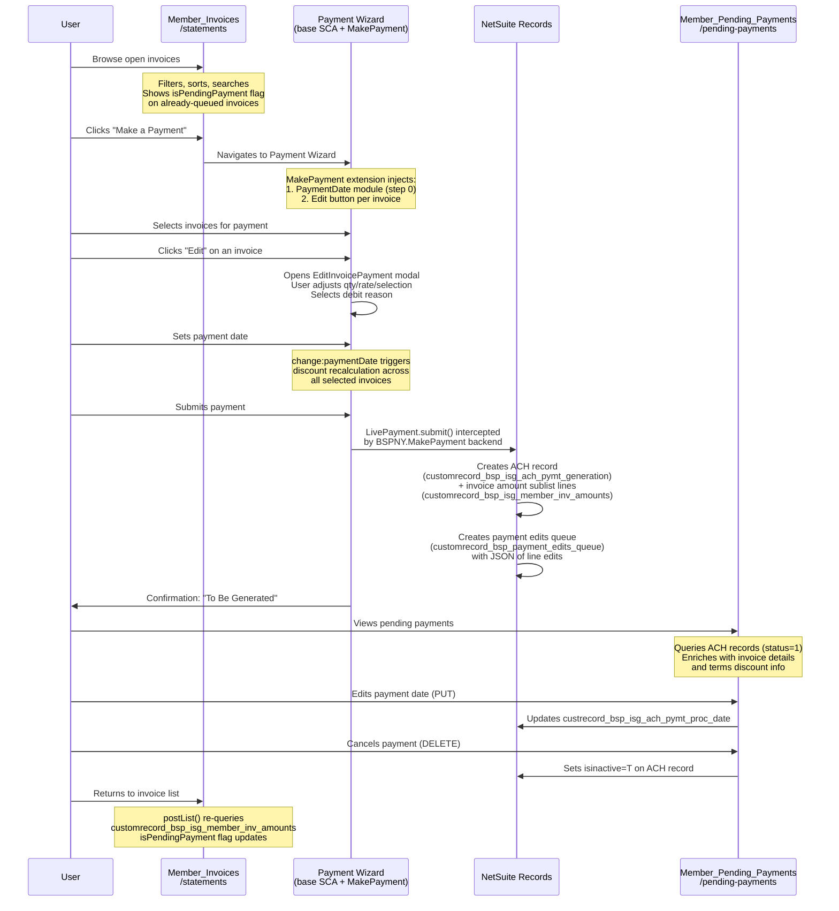

# Member Invoices, Make a Payment & Pending Payments — Module Interaction Guide

## Purpose

This document describes three custom BSP extensions that work together to provide the full invoice-to-payment lifecycle in the ISG portal:

| Extension | Route | Role |
|-----------|-------|------|
| **Member_Invoices** | `/statements` | Browse, filter, search, and act on open/paid invoices |
| **MakePayment** | *(extends Payment Wizard)* | Edit invoice line items, set payment date, and submit ACH payments |
| **Member_Pending_Payments** | `/pending-payments` | View, edit date, and cancel queued ACH payments |

---

## 1. Member_Invoices

### Key Responsibilities

- Extends the base SCA `Invoice.OpenList.View` with advanced filtering (date range, supplier multi-select, PO #, invoice #, payment ref #, supplier invoice #, aging buckets, "is new" flag)
- Pagination with configurable items per page (10 / 50 / 100 / 1000 / All)
- Selectable invoice rows for batch print, email, and "mark as viewed" actions
- Enriches each invoice with **`isPendingPayment`** flag (queried from `customrecord_bsp_isg_member_inv_amounts`) and **`paymentRef`** (from applied `customerpayment` records)
- Navigation buttons to **Make a Payment** and **Pay by Amount** (conditional on `custentity_bsp_pay_by_amount` profile flag)

### SuiteScript Version

All backend files are **SuiteScript 1.0** (SSP libraries, AMD `define()` pattern).

### Architecture

```
┌─────────────────────────────────────────────────────────────┐
│ Frontend (Backbone.js / ES5 / AMD)                          │
│                                                             │
│  Main.js ─── mountToApp ──▶ registers route "/statements"   │
│       │                                                     │
│       ├── Invoice.OpenList.View (extends base SCA)          │
│       │       ├── ListHeader.View (filters, MultiSelect)    │
│       │       ├── Invoice.Actions (print/email/mark viewed) │
│       │       ├── Email.View (email modal)                  │
│       │       └── RecordViews.Selectable.View (row render)  │
│       │                                                     │
│       ├── Invoice.Collection (extends base SCA)             │
│       └── Supplier.Model (fetches vendor list)              │
└──────────────────────┬──────────────────────────────────────┘
                       │ REST
┌──────────────────────▼──────────────────────────────────────┐
│ Backend (SuiteScript 1.0)                                   │
│                                                             │
│  Invoice.ServiceController (extends base)                   │
│       └── Invoice.Model (extends base)                      │
│               ├── setExtraListFilters() — date, supplier,   │
│               │    aging, PO#, invoice#, payment ref, etc.  │
│               ├── setExtraListColumns() — custbody_is_viewed│
│               └── postList() — enriches results:            │
│                       ├── queries pending payments           │
│                       │   (customrecord_bsp_isg_member_inv_ │
│                       │    amounts → isPendingPayment flag)  │
│                       └── queries customer payments          │
│                           (customerpayment → paymentRef)     │
│                                                             │
│  Supplier.ServiceController → Supplier.Model (vendor list)  │
└─────────────────────────────────────────────────────────────┘
```

### Entry Point & Routes

| File | Module ID | Type |
|------|-----------|------|
| `BSP.Member_Invoices.Main.js` | `BSP.Member_Invoices.Main` | Entry point (`mountToApp`) |

- **Route:** `/statements`
- **Page Type:** `OpenInvoicesHistory`
- **Menu:** None (accessed via navigation buttons)

### Frontend Components

| File | Module ID | Type | Purpose |
|------|-----------|------|---------|
| `BSP.Member_Invoices.Invoice.OpenList.View.js` | `BSP.Member_Invoices.Invoice.OpenList.View` | View | Main list view; fetches suppliers + invoices, builds selectable rows |
| `BSP.Member_Invoices.Invoice.Collection.js` | `BSP.Member_Invoices.Invoice.Collection` | Collection | Extends base; handles filter updates, page/overall balance calculation |
| `BSP.Member_Invoices.ListHeader.View.js` | `BSP.Member_Invoices.ListHeader.View` | View | All filter controls; manages URL params and collection updates |
| `BSP.Member_Invoices.Invoice.Actions.js` | `BSP.Member_Invoices.Invoice.Actions` | View | Print/email/mark-as-viewed buttons; opens Suitelet or email modal |
| `BSP.Member_Invoices.Email.View.js` | `BSP.Member_Invoices.Email.View` | View | Email modal; sends selected invoice IDs to Suitelet |
| `BSP.Member_Invoices.RecordViews.Selectable.View.js` | `BSP.Member_Invoices.RecordViews.Selectable.View` | View | Invoice row; shows bold if unviewed, red if pending payment |
| `BSP.Member_Invoices.Supplier.Model.js` | `BSP.Member_Invoices.Supplier.Model` | Model | Fetches supplier list for dropdown |
| `MultiSelect.js` | `MultiSelect` | Utility | Vanilla JS multi-select component |

### Backend Components

| File | Module ID | Purpose |
|------|-----------|---------|
| `BSP.Member_Invoices.Invoice.ServiceController.js` | `BSP.Member_Invoices.Invoice.ServiceController` | REST GET — receives filter params, delegates to Model |
| `BSP.Member_Invoices.Invoice.Model.js` | `BSP.Member_Invoices.Invoice.Model` | Builds NS search filters; enriches results with pending payment + paymentRef |
| `BSP.Member_Invoices.Supplier.Model.js` | `BSP.Member_Invoices.Supplier.Model` | Searches active vendors |
| `BSP.Member_Invoices.Suppliers.ServiceController.js` | `BSP.Member_Invoices.Suppliers.ServiceController` | REST GET for supplier list |

### Custom NetSuite Fields Referenced

| Field ID | Record | Purpose |
|----------|--------|---------|
| `custbody_bsp_is_new` | Invoice | "New invoice" flag (T/F) |
| `custbody_bsp_is_viewed` | Invoice | "Viewed by member" flag |
| `custbody_bsp_inv_vendor_name` | Invoice | Supplier/vendor reference |
| `custbody_bsp_vend_invoice_number` | Invoice | Supplier's invoice number |
| `custentity_bsp_pay_by_amount` | Customer | Feature flag for "Pay by Amount" button |

### Templates

| File | Purpose |
|------|---------|
| `member_invoice_open_list.tpl` | Main page layout with nav buttons, filters, balance card, results table |
| `invoice_list_header.tpl` | Filter form (date, supplier, invoice#, PO#, etc.) |
| `invoice_actions_buttons.tpl` | Print/email/mark-as-viewed action buttons |
| `invoice_email.tpl` | Email modal form |
| `invoice_recordviews_selectable.tpl` | Single invoice row with pending payment indicator |

---

## 2. MakePayment

### Key Responsibilities

- Adds a **Payment Date** picker module to the Payment Wizard steps
- Enables **line-item editing** on invoices before payment (change quantity, rate, select/deselect lines)
- Captures a **debit reason** for edited invoices
- Recalculates invoice totals considering **discount dates** vs. payment date
- On submission, creates an **ACH payment generation record** and a **payment edits queue record** in NetSuite (instead of the standard customer payment)

### SuiteScript Version

All backend files are **SuiteScript 1.0** (SSP libraries, AMD `define()` pattern).

### Architecture

```
┌────────────────────────────────────────────────────────────────┐
│ Frontend — Prototype Extensions (no new routes)                │
│                                                                │
│  BSPNY.MakePayment.js (mountToApp)                             │
│    ├── Extends PaymentWizard.Module.Invoice                    │
│    │     └── editInvoice() — opens EditInvoicePayment modal    │
│    ├── Extends PaymentWizard.Module.Invoice.Subject.View       │
│    │     └── getContext() — discount date logic                │
│    ├── Extends PaymentWizard.Module.Summary                    │
│    │     └── change:paymentDate — recalculates totals          │
│    ├── Extends LivePayment.Model                               │
│    │     └── calculeTotal() — full total with discounts+edits  │
│    │     └── changeCurrencyCall() — adds trandate param        │
│    ├── Registers PaymentWizard.Module.PaymentDate              │
│    │     └── Date picker at step 0 of make-a-payment           │
│    └── Transforms invoice collection rows                      │
│          └── Shows payment edit details row beneath invoice    │
│                                                                │
│  EditInvoicePayment.View — Modal for editing invoice lines     │
│    └── InvoicePaymentEdit.Model — Line-level edit state        │
│          └── LineModel — qty, rate, selected, amount           │
│                                                                │
│  PaymentWizard.Module.PaymentDate — Date input wizard module   │
└────────────────────────┬───────────────────────────────────────┘
                         │ On submit
┌────────────────────────▼───────────────────────────────────────┐
│ Backend (SuiteScript 1.0)                                      │
│                                                                │
│  BSPNY.MakePayment.js — Intercepts LivePayment.submit()        │
│    ├── Creates PaymentEditsQueue.Model                         │
│    │     ├── saveACHRecord()                                   │
│    │     │   └── customrecord_bsp_isg_ach_pymt_generation      │
│    │     │       + sublist: customrecord_bsp_isg_member_inv_   │
│    │     │         amounts (one line per invoice)               │
│    │     └── save()                                            │
│    │         └── customrecord_bsp_payment_edits_queue           │
│    │             (JSON blob of line edits)                      │
│    └── Returns { tranid: 'To Be Generated' }                  │
└────────────────────────────────────────────────────────────────┘
```

### Entry Point

| File | Module ID | Type |
|------|-----------|------|
| `BSPNY.MakePayment.js` | `BSPNY.MakePayment` | Entry point — extends existing wizard prototypes via `mountToApp` |

No new routes are registered. This extension **modifies the existing Payment Wizard** behavior.

### Frontend Components

| File | Module ID | Type | Purpose |
|------|-----------|------|---------|
| `BSPNY.MakePayment.js` | `BSPNY.MakePayment` | Entry point | Extends 5 base SCA prototypes + registers PaymentDate module |
| `EditInvoicePayment.View.js` | `EditInvoicePayment.View` | View | Modal to edit invoice lines (qty, rate, selection, debit reason) |
| `InvoicePaymentEdit.Model.js` | `InvoicePaymentEdit.Model` | Model | Tracks line edits, calculates subtotal, validates debit reason |
| `PaymentWizard.Module.PaymentDate.js` | `PaymentWizard.Module.PaymentDate` | Wizard Module | Date picker injected into payment wizard steps |

### Backend Components

| File | Module ID | Purpose |
|------|-----------|---------|
| `BSPNY.MakePayment.js` | `BSPNY.MakePayment` | Intercepts `LivePayment.submit()`, creates ACH + queue records |
| `PaymentEditsQueue.Model.js` | `PaymentEditsQueue.Model` | Creates `customrecord_bsp_isg_ach_pymt_generation` (ACH record) and `customrecord_bsp_payment_edits_queue` (edit details) |

### Custom NetSuite Records Created

| Record Type | Purpose |
|-------------|---------|
| `customrecord_bsp_isg_ach_pymt_generation` | ACH payment generation record (parent) |
| `customrecord_bsp_isg_member_inv_amounts` | Invoice amounts sublist (child, one per invoice) |
| `customrecord_bsp_payment_edits_queue` | JSON blob of all line-level edits |

### Key Fields on ACH Record

| Field ID | Purpose |
|----------|---------|
| `custrecord_bsp_isg_ach_pymt_member` | Customer/member ID |
| `custrecord_bsp_isg_ach_pymt_paymethod` | Payment method (ACH) |
| `custrecord_bsp_isg_ach_pymt_proc_date` | Payment processing date |
| `custrecord_bsp_isg_payment_total_amount` | Total payment amount |
| `custrecord_bsp_isg_standalone_pay_amount` | Standalone (manual) payment amount |

### Key Fields on Invoice Amount Sublist

| Field ID | Purpose |
|----------|---------|
| `custrecord_bsp_isg_ach_pymt_parent` | Parent ACH record |
| `custrecord_bsp_isg_member_invocies` | Linked invoice ID |
| `custrecord_bsp_isg_ach_inv_amount` | Invoice due with discount |
| `custrecord_bsp_isg_invoice_amount` | Invoice amount after edits |

### Templates

| File | Purpose |
|------|---------|
| `edit_invoice_payment.tpl` | Modal: line item table with qty/rate inputs, debit reason dropdown, comment |
| `payment_wizard_payment_date_module.tpl` | Date picker accordion for payment wizard |

### Debit Reasons (Predefined)

`partial_payment`, `concealed_damage`, `customer_error`, `damaged`, `defective`, `duplicate_invoice`, `freight_charge`, `incorrect_price`, `incorrect_quantity`, `late_delivery`, `missing_items`, `not_ordered`, `pricing_dispute`, `quality_issue`, `returned_goods`, `short_shipment`, `other`

---

## 3. Member_Pending_Payments

### Key Responsibilities

- Lists all **pending ACH payments** (status = 1) for the logged-in member
- Enriches each payment with its linked **invoice details** (invoice #, amounts, terms discount)
- Allows **editing the payment date** (PUT to update `custrecord_bsp_isg_ach_pymt_proc_date`)
- Allows **canceling a payment** (sets `isinactive = T` on the ACH record)
- Provides **invoice detail drill-down** modal with links back to invoice pages

### SuiteScript Version

All backend files are **SuiteScript 1.0** (SSP libraries, AMD `define()` pattern).

### Architecture

```
┌──────────────────────────────────────────────────────────────┐
│ Frontend (Backbone.js / ES5 / AMD)                           │
│                                                              │
│  Pending_Payments.Main.js ─── mountToApp                     │
│    ├── Adds menu "Pending Payments" under accounting-center  │
│    └── Registers route "/pending-payments"                   │
│                                                              │
│  Pending_Payments.View (main list)                           │
│    ├── ListHeader (sort by date, pagination)                 │
│    ├── Pending_PaymentsCollection.View                       │
│    │     └── Pending_PaymentsRow.View (per payment)          │
│    │           ├── Edit button → EditModal.View              │
│    │           ├── Delete button → DeleteConfirmModal.View   │
│    │           └── View Details → InvoiceDetailsModal.View   │
│    └── Pagination                                            │
│                                                              │
│  Pending_Payments.Collection ──▶ REST GET                    │
│  EditModal ──▶ REST PUT (update date)                        │
│  DeleteConfirmModal ──▶ REST DELETE (inactivate)             │
└──────────────────────┬───────────────────────────────────────┘
                       │
┌──────────────────────▼───────────────────────────────────────┐
│ Backend (SuiteScript 1.0)                                    │
│                                                              │
│  Pending_Payments.ServiceController                          │
│    ├── GET  → Model.list()  — paginated pending payments     │
│    ├── PUT  → Model.update() — change payment date           │
│    └── DELETE (via query) → Model.remove() — set inactive    │
│                                                              │
│  Pending_Payments.Model                                      │
│    ├── Searches customrecord_bsp_isg_ach_pymt_generation     │
│    │     (status=1, member=current user)                     │
│    ├── Enriches with invoice details from                    │
│    │     customrecord_bsp_isg_member_inv_amounts             │
│    └── Enriches with terms discount from invoice records     │
└──────────────────────────────────────────────────────────────┘
```

### Entry Point & Routes

| File | Module ID | Type |
|------|-----------|------|
| `Pending_Payments.Main.js` | `Pending_Payments.Main` | Entry point (`mountToApp`) |

- **Route:** `/pending-payments`
- **Page Type:** `Pending_Payments`
- **Menu:** "Pending Payments" under `accounting-center` (members only, not vendors)

### Frontend Components

| File | Module ID | Type | Purpose |
|------|-----------|------|---------|
| `Pending_Payments.Main.js` | `Pending_Payments.Main` | Entry point | Route + menu registration |
| `Pending_Payments.View.js` | `Pending_Payments.View` | View | Main list with sort/pagination |
| `Pending_Payments.Collection.js` | `Pending_Payments.Collection` | Collection | Fetches paginated payments; supports mock data |
| `Pending_PaymentsCollection.View.js` | `Pending_PaymentsCollection.View` | Collection View | Renders rows |
| `Pending_PaymentsRow.View.js` | `Pending_PaymentsRow.View` | View | Single payment row with action buttons |
| `Pending_PaymentEditModal.View.js` | `Pending_PaymentEditModal.View` | View | Edit payment date modal (PUT) |
| `Pending_PaymentDeleteConfirmModal.View.js` | `Pending_PaymentDeleteConfirmModal.View` | View | Cancel payment confirmation (DELETE) |
| `Pending_PaymentInvoiceDetailsModal.View.js` | `Pending_PaymentInvoiceDetailsModal.View` | View | Invoice details drill-down modal |

### Backend Components

| File | Module ID | Purpose |
|------|-----------|---------|
| `Pending_Payments.ServiceController.js` | `Pending_Payments.ServiceController` | REST GET/PUT/DELETE handler |
| `Pending_Payments.Model.js` | `Pending_Payments.Model` | CRUD on ACH records + invoice detail enrichment |

---

## 4. How the Three Modules Interact

### End-to-End Payment Flow



### Shared Custom Record: The ACH Payment Record

The **`customrecord_bsp_isg_ach_pymt_generation`** record is the central data object connecting all three modules:

| Module | Interaction | Fields Used |
|--------|-------------|-------------|
| **MakePayment** (backend) | **Creates** the record on payment submit | `ach_pymt_member`, `ach_pymt_paymethod`, `ach_pymt_proc_date`, `payment_total_amount`, `standalone_pay_amount` |
| **Member_Invoices** (backend) | **Reads** via `postList()` to detect pending payments | Queries child `customrecord_bsp_isg_member_inv_amounts` where parent status = 1 → sets `isPendingPayment` flag |
| **Member_Pending_Payments** (backend) | **Reads** (list), **Updates** (date change), **Deletes** (inactivate) | All fields + enriches with invoice details from child records |

### Shared Custom Record: Invoice Amounts Sublist

The **`customrecord_bsp_isg_member_inv_amounts`** record links invoices to ACH payments:

| Field | Purpose |
|-------|---------|
| `custrecord_bsp_isg_ach_pymt_parent` | Parent ACH payment record |
| `custrecord_bsp_isg_member_invocies` | Linked invoice internal ID |
| `custrecord_bsp_isg_ach_inv_amount` | Invoice amount with discount |
| `custrecord_bsp_isg_invoice_amount` | Invoice amount after edits |
| `custrecord_bsp_isg_ach_pymt_status` | Payment status (1 = pending) |
| `custrecord_bsp_isg_ach_pymt_member` | Member/customer reference |

### Discount Date Logic (MakePayment)

The MakePayment extension implements discount-aware payment calculation:

1. Each invoice may have a `duewithdiscount` amount and a `discountdate`
2. When the user sets a **payment date**:
   - If `paymentDate <= discountDate` → use `duewithdiscount` (discounted amount)
   - If `paymentDate > discountDate` → use `original_amount` (full amount)
3. If the user has **edited lines** (via `paymentEdits`), the edit `subtotal` is subtracted from whichever amount applies
4. `LivePayment.Model.calculeTotal()` iterates all invoices, applies this logic, and recalculates the total using BigNumber precision

### Data Flow: Invoice → Payment → Pending Payment Detection

```
Invoice (NS record)
    │
    ├── Displayed in Member_Invoices list view
    │     └── postList() checks: does this invoice have a child record
    │         in customrecord_bsp_isg_member_inv_amounts where
    │         parent.status = 1 and parent.member = current user?
    │         → YES: isPendingPayment = true (red text + tooltip)
    │
    ├── Selected in Payment Wizard
    │     └── User optionally edits lines → paymentEdits stored on model
    │     └── User sets payment date → discount recalculation
    │
    ├── On submit (MakePayment backend):
    │     ├── ACH record created (customrecord_bsp_isg_ach_pymt_generation)
    │     ├── Invoice amount line added (customrecord_bsp_isg_member_inv_amounts)
    │     └── Edit queue record created (customrecord_bsp_payment_edits_queue)
    │
    └── Visible in Pending Payments
          ├── ACH record listed with invoice details
          ├── User can change date → updates proc_date field
          └── User can cancel → sets isinactive=T
                └── Invoice no longer shows isPendingPayment in list
```

---

## 5. Module Dependency Graph

```mermaid
graph TD
    subgraph "Member_Invoices Extension"
        MI_Main["BSP.Member_Invoices.Main"]
        MI_View["Invoice.OpenList.View"]
        MI_Coll["Invoice.Collection"]
        MI_LH["ListHeader.View"]
        MI_Actions["Invoice.Actions"]
        MI_Email["Email.View"]
        MI_Row["RecordViews.Selectable.View"]
        MI_Supplier["Supplier.Model"]
        MI_SC["Invoice.ServiceController (BE)"]
        MI_Model["Invoice.Model (BE)"]
    end

    subgraph "MakePayment Extension"
        MP_Main["BSPNY.MakePayment"]
        MP_Edit["EditInvoicePayment.View"]
        MP_EditModel["InvoicePaymentEdit.Model"]
        MP_Date["PaymentWizard.Module.PaymentDate"]
        MP_BE["BSPNY.MakePayment (BE)"]
        MP_Queue["PaymentEditsQueue.Model (BE)"]
    end

    subgraph "Member_Pending_Payments Extension"
        PP_Main["Pending_Payments.Main"]
        PP_View["Pending_Payments.View"]
        PP_Coll["Pending_Payments.Collection"]
        PP_Row["Pending_PaymentsRow.View"]
        PP_EditModal["EditModal.View"]
        PP_DeleteModal["DeleteConfirmModal.View"]
        PP_InvModal["InvoiceDetailsModal.View"]
        PP_SC["ServiceController (BE)"]
        PP_Model["Model (BE)"]
    end

    subgraph "Base SCA Modules"
        SCA_InvView["Invoice.OpenList.View"]
        SCA_InvColl["Invoice.Collection"]
        SCA_InvModel["Invoice.Model (BE)"]
        SCA_InvSC["Invoice.ServiceController (BE)"]
        SCA_LP["LivePayment.Model"]
        SCA_PW["PaymentWizard.*"]
    end

    subgraph "NetSuite Custom Records"
        ACH["customrecord_bsp_isg_ach_pymt_generation"]
        INV_AMT["customrecord_bsp_isg_member_inv_amounts"]
        EDITS["customrecord_bsp_payment_edits_queue"]
    end

    MI_View --> SCA_InvView
    MI_Coll --> SCA_InvColl
    MI_SC --> SCA_InvSC
    MI_Model --> SCA_InvModel

    MP_Main --> SCA_PW
    MP_Main --> SCA_LP
    MP_BE --> SCA_LP

    MI_Model -.->|reads| INV_AMT
    MI_Model -.->|reads| ACH

    MP_BE -->|creates| ACH
    MP_BE -->|creates| INV_AMT
    MP_Queue -->|creates| EDITS

    PP_Model -.->|reads/updates/deletes| ACH
    PP_Model -.->|reads| INV_AMT

    MI_Main -.->|"Make a Payment" button| SCA_PW
    PP_InvModal -.->|invoice link| MI_View
```



---

## 6. File Locations

### Member_Invoices
```
extensions/Workspace/Member_Invoices/
├── manifest.json
├── Modules/Main/
│   ├── JavaScript/          (10 files)
│   ├── Templates/           (6 files)
│   ├── Sass/                (4 files)
│   ├── SuiteScript/         (5 files)
│   └── Configuration/       (MemberInvoice.json)
└── assets/services/         (Main.Service.ss)
```

### MakePayment
```
extensions/Workspace/MakePayment/
├── manifest.json
├── Modules/MakePayment/
│   ├── JavaScript/          (4 files)
│   ├── Templates/           (2 files)
│   ├── Sass/                (1 file)
│   ├── SuiteScript/         (2 files)
│   └── Configuration/       (MakePayment.json)
└── assets/services/         (InvoicePaymentEdit.Service.ss)
```

### Member_Pending_Payments
```
extensions/Workspace/Member_Pending_Payments/
├── manifest.json
├── Modules/Pending_Payments/
│   ├── JavaScript/          (9 files)
│   ├── Templates/           (6 files)
│   ├── Sass/                (1 file)
│   └── SuiteScript/         (3 files)
└── assets/services/         (Pending_Payments.Service.ss)
```
