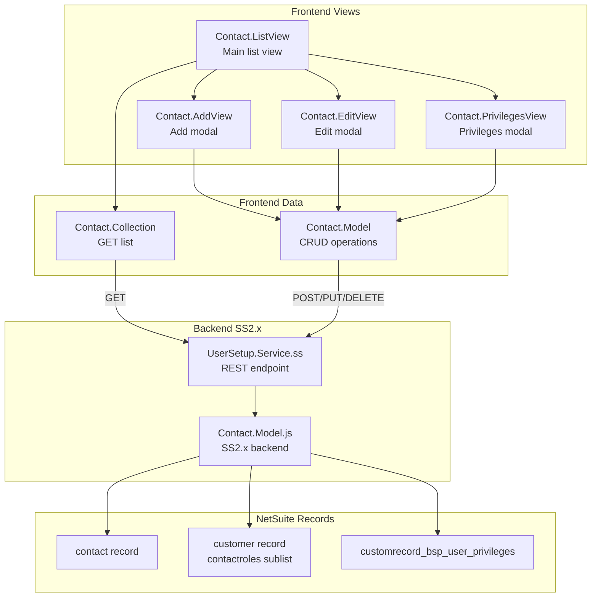

# UserSetup Extension

## Purpose

Manages contact users and their access privileges for a company account. Principal users can add, edit, and remove contacts, and assign hierarchical privilege sets that control which portal features each contact can access. Used by both vendors and members.

## Key Responsibilities

- List all contacts associated with the current company/customer
- Add new contacts with optional portal access (creates NetSuite Contact record)
- Edit existing contact details (name, email, phone)
- Manage per-contact privilege assignments via hierarchical user types
- Toggle portal access for contacts (grant/revoke)
- Delete contacts

## SuiteScript Version

- **Backend Model:** SuiteScript 2.x (`SuiteScript2/Contact.Model.js` using `require('N/record')`, `require('N/search')`, `require('N/runtime')`)
- **Service endpoint:** SuiteScript 2.x (`SuiteScript2/UserSetup.Service.ss`)
- **Legacy ServiceController:** SS1.0 (`SuiteScript/UserSetup.ServiceController.js`)

## NS Records Touched

| Record Type | API | Usage |
|-------------|-----|-------|
| `contact` (standard) | `N/record` | Create, read, update, delete contacts |
| `customer` (standard) | `N/record` | Read `contactroles` sublist to list/manage contacts |
| `customrecord_bsp_user_privileges` | `N/record`, `N/search` | Store per-contact privilege flags |

## Entry Point

**File:** `Modules/UserSetup/JavaScript/BSP.UserSetup.js`

- **Menu:** Adds "User Setup" under Settings group (index 4)
- **Routes:** `user-setup`, `user-setup?*params`
- **Touchpoint:** myaccount

## Module Components

### Frontend

| Component | File | Role |
|-----------|------|------|
| **Main** | `BSP.UserSetup.js` | Entry point, route + menu registration |
| **Contact.ListView** | `Contact.ListView.js` | Main view — lists contacts, triggers add/edit/privileges/remove modals |
| **Contact.AddView** | `Contact.AddView.js` | Modal — create new contact (name, email, password, access toggle) |
| **Contact.EditView** | `Contact.EditView.js` | Modal — edit contact details |
| **Contact.PrivilegesView** | `Contact.PrivilegesView.js` | Modal — hierarchical privilege checkboxes |
| **Contact.Model** | `Contact.Model.js` | Frontend model with `setPrivileges()` method |
| **Contact.Collection** | `Contact.Collection.js` | Collection for fetching contact list |
| **BSP.UserSetup.Model** | `BSP.UserSetup.Model.js` | Additional model (legacy/alternate) |
| **BSP.UserSetup.SS2Model** | `BSP.UserSetup.SS2Model.js` | Model pointing to SuiteScript 2.x service |

### Templates

| Template | Purpose |
|----------|---------|
| `contact_list.tpl` | Contact list with action buttons |
| `contact_add.tpl` | Add contact modal form |
| `contact_edit.tpl` | Edit contact modal form |
| `contact_privileges.tpl` | Privilege checkboxes modal |
| `bsp_usersetup_usersetup.tpl` | Main wrapper template |

### Backend (SuiteScript 2.x)

| File | Role |
|------|------|
| `SuiteScript2/Contact.Model.js` | Full CRUD for contacts + privilege management |
| `SuiteScript2/UserSetup.Service.ss` | REST endpoint |

## Data Flow

## Privilege System

### Hierarchy

When **Principal User** is checked, all user types and all individual privileges are automatically enabled and disabled (greyed out).

When a **User Type** is checked, its associated privileges are enabled:

| User Type | Privileges |
|-----------|-----------|
| Accounting | bankingSetup, debitMemoRequest, invoicePickup, makePayment, messageBoard, remainderOfSite |
| Purchasing | invoicePickup, messageBoard, rebateAccess, purchasingSummaryReport |
| General | remainderOfSite, supplierDirectory |

### Custom Record Field Mapping

| NetSuite Field ID | Privilege Name |
|-------------------|---------------|
| `custrecord_bsp_priv_manageuser` | addDeleteUsers |
| `custrecord_bsp_priv_bankingsetup` | bankingSetup |
| `custrecord_bps_priv_debitmemo` | debitMemoRequest |
| `custrecord_bsp_priv_invoice` | invoicePickup |
| `custrecord_bsp_priv_makepayment` | makePayment |
| `custrecord_bsp_priv_messageboard` | messageBoard |
| `custrecord_bsp_priv_rebateaccess` | rebateAccess |
| `custrecord_bsp_priv_rebatereport` | rebateReport |
| `custrecord_bsp_priv_remaindersite` | remainderOfSite |
| `custrecord_bsp_priv_posummary` | purchasingSummaryReport |
| `custrecord_bsp_priv_supplierdir` | supplierDirectory |

### Backend Operations

| Method | Description |
|--------|-------------|
| `create(contactData)` | Creates contact record, attaches to customer, sets access |
| `read(contactId)` | Loads contact with full privilege data |
| `update(contactId, data)` | Updates contact fields or privileges (based on `updatePrivileges` flag) |
| `delete(contactId)` | Removes from customer contactroles, deletes contact record |
| `list()` | Lists all contacts from customer's contactroles sublist |
| `getPrivileges(contactId)` | Searches privilege custom record for contact |
| `updatePrivileges(contactId, data)` | Creates or updates privilege custom record |

## Dependencies

- `Backbone`, `underscore`, `jQuery`
- `Profile.Model`
- `MyAccountMenu`
- `GlobalViews.Modal.View`
