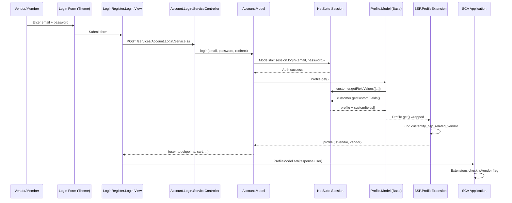
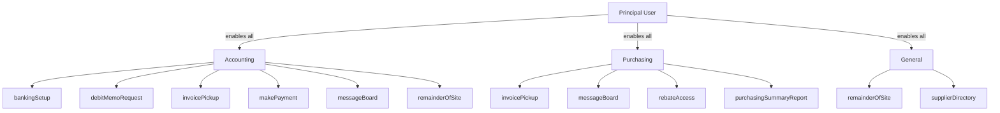
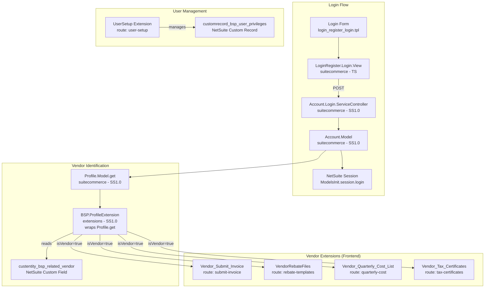

# Vendor Authentication & Access Control

## Overview

Vendors log into the ISG portal using the **same standard SuiteCommerce login form** as members. There is no separate vendor login page. After authentication, the system determines whether the logged-in user is a vendor or a member by inspecting a custom field on their NetSuite entity record. Vendor-specific extensions then show or hide themselves based on this flag.

## Authentication Flow

### Login Sequence



### Step-by-Step Breakdown

1. **User submits login form** — Standard email/password form from `theme/Workspace/ISG_SuiteCommerce_Theme/Modules/LoginRegister/Templates/login_register_login.tpl`
2. **POST to login service** — `LoginRegister.Login.View` sends credentials to `services/Account.Login.Service.ss`
3. **NetSuite native authentication** — `Account.Model.login()` calls `ModelsInit.session.login({email, password})` (built-in NetSuite auth)
4. **Profile loaded with custom fields** — `Profile.Model.get()` calls `ModelsInit.customer.getCustomFields()` which returns all custom fields including `custentity_bsp_related_vendor`
5. **ProfileExtension wraps Profile.get()** — Searches `customfields` array for `custentity_bsp_related_vendor`, sets `isVendor = true` and `vendor = <vendor_id>` if found
6. **Response sent to frontend** — Full profile object (with `isVendor` and `vendor` properties) available via `ProfileModel.getInstance()`
7. **Extensions gate on isVendor** — Each vendor extension checks `profile.get('isVendor')` in its `mountToApp` entry point

## Key Components

### ProfileExtension (Vendor Identification)

**File:** `extensions/Workspace/ProfileExtension/Modules/ProfileExtension/SuiteScript/BSP.ProfileExtension.js`

This is the critical piece that identifies vendors. It wraps the base `Profile.Model.get()` function server-side:

```javascript
define("BSP.ProfileExtension", ["Profile.Model", "underscore"], function (
  ProfileModel, _
) {
  "use strict";

  _.extend(ProfileModel, {
    get: _.wrap(ProfileModel.get, function (fn) {
      var value = fn.apply(this, _.toArray(arguments).slice(1));
      if (value) {
        value.isVendor = false;
        var vendor = _.find(value.customfields, function (customField) {
          return customField.name === 'custentity_bsp_related_vendor';
        });

        if (vendor.value) {
          value.isVendor = true;
          value.vendor = vendor.value;
        }
      }
      return value;
    }),
  });
});
```

**Custom Field:** `custentity_bsp_related_vendor`
- Located on the NetSuite Customer/Contact entity record
- If it has a value, the user is a vendor and the value is their vendor record internal ID
- If empty/null, the user is a member

### Vendor Access Gate Pattern

Every vendor extension uses this identical pattern in its `mountToApp`:

```javascript
var profile = ProfileModel.getInstance();
var isMember = !profile.get('isVendor');

if (isMember) {
  return; // Exit — hide all vendor features from members
}

// Register routes, menus, etc. for vendors only
```

This pattern appears in:
- `Vendor_Submit_Invoice/Modules/Main/JavaScript/Vendor_Submit_Invoice.Main.js`
- `VendorRebateFiles/Modules/Main/JavaScript/BSP.VendorRebateFiles.Main.js`
- `Vendor_Quarterly_Cost_List/Modules/Main/JavaScript/Vendor_Quarterly_Cost_List.Main.js`
- `Vendor_Tax_Certificates/Modules/Main/JavaScript/BSP.Vendor_Tax_Certificates.Main.js`

### Standard SCA Login Infrastructure (Read-Only Reference)

| File | Purpose |
|------|---------|
| `suitecommerce/Advanced/LoginRegister/JavaScript/LoginRegister.Login.View.ts` | Frontend login view & form submission |
| `suitecommerce/Advanced/Account/JavaScript/Account.Login.Model.ts` | Backbone model for login data |
| `suitecommerce/Advanced/Account/SuiteScript/Account.Login.ServiceController.js` | Login endpoint controller |
| `suitecommerce/Advanced/Account/SuiteScript/Account.Model.js` | Backend login orchestration |
| `suitecommerce/Commons/Profile/SuiteScript/Profile.Model.js` | Base profile retrieval (loads customfields) |

## User Privilege System (UserSetup Extension)

### Overview

The **UserSetup** extension manages contact-level privileges for both vendors and members. A principal user (company admin) can add/remove contacts and assign privileges that control which portal features each contact can access.

### Privilege Hierarchy



### User Types

| Type | Privileges Included |
|------|-------------------|
| **Principal User** | All privileges (full access, automatically enables all user types) |
| **Accounting** | bankingSetup, debitMemoRequest, invoicePickup, makePayment, messageBoard, remainderOfSite |
| **Purchasing** | invoicePickup, messageBoard, rebateAccess, purchasingSummaryReport |
| **General** | remainderOfSite, supplierDirectory |

### NetSuite Custom Record: `customrecord_bsp_user_privileges`

| NetSuite Field | UI Name |
|---------------|---------|
| `custrecord_bsp_priv_manageuser` | addDeleteUsers |
| `custrecord_bsp_priv_bankingsetup` | bankingSetup |
| `custrecord_bps_priv_debitmemo` | debitMemoRequest |
| `custrecord_bsp_priv_invoice` | invoicePickup |
| `custrecord_bsp_priv_makepayment` | makePayment |
| `custrecord_bsp_priv_messageboard` | messageBoard |
| `custrecord_bsp_priv_rebateaccess` | rebateAccess |
| `custrecord_bsp_priv_rebatereport` | rebateReport |
| `custrecord_bsp_priv_remaindersite` | remainderOfSite |
| `custrecord_bsp_priv_posummary` | purchasingSummaryReport |
| `custrecord_bsp_priv_supplierdir` | supplierDirectory |

### UserSetup Key Files

| File | Role |
|------|------|
| `JavaScript/BSP.UserSetup.js` | Entry point — registers route `user-setup` under Settings menu |
| `JavaScript/Contact.ListView.js` | Main view listing all contacts with add/edit/privileges/remove actions |
| `JavaScript/Contact.AddView.js` | Modal form to create new contacts (name, email, password, access toggle) |
| `JavaScript/Contact.EditView.js` | Modal form to edit existing contact details |
| `JavaScript/Contact.PrivilegesView.js` | Modal with hierarchical privilege checkboxes |
| `JavaScript/Contact.Model.js` | Frontend model — URL points to `SuiteScript2/UserSetup.Service.ss` |
| `JavaScript/Contact.Collection.js` | Collection for fetching contact list |
| `SuiteScript2/Contact.Model.js` | Backend model (SS2.x) — CRUD for contacts and privileges |
| `SuiteScript2/UserSetup.Service.ss` | REST endpoint for UserSetup operations |

## Vendor Portal Navigation

When a vendor logs in, only vendor extensions register their routes and menu entries. The portal menu looks like:

| Menu Group | Menu Entry | Route | Extension |
|-----------|-----------|-------|-----------|
| Supplier Info | Submit Invoice | `submit-invoice` | Vendor_Submit_Invoice |
| File Processing | Rebate Templates | `rebate-templates` | VendorRebateFiles |
| — | Quarterly Cost-List | `quarterly-cost` | Vendor_Quarterly_Cost_List |
| — | Tax Certificates | `tax-certificates` | Vendor_Tax_Certificates |
| Settings | User Setup | `user-setup` | UserSetup |

## Architecture Diagram



## Summary

- **No custom login** — Vendors use the standard SuiteCommerce login form with NetSuite native authentication
- **Vendor detection** happens server-side via `ProfileExtension` which wraps `Profile.Model.get()` and checks the `custentity_bsp_related_vendor` custom field
- **Access control** is client-side — each vendor extension checks `profile.get('isVendor')` in `mountToApp` and exits early for non-vendors
- **Privilege management** is handled by the `UserSetup` extension with a hierarchical role system stored in `customrecord_bsp_user_privileges`
