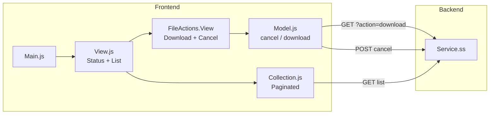

# Vendor_Quarterly_Cost_List Extension

## Purpose

Allows vendors to view and manage quarterly cost list processing files. Vendors can browse submitted files, download them, and cancel files that haven't already been cancelled.

## Key Responsibilities

- Display paginated list of quarterly cost files with status information
- Download individual cost list files
- Cancel files (with confirmation dialog) when status allows it
- Auto-refresh list after cancellation

## SuiteScript Version

- **Service endpoint:** SS1.0 (`services/Vendor_Quarterly_Cost_List.Service.ss`)

## Entry Point

**File:** `Modules/Main/JavaScript/Vendor_Quarterly_Cost_List.Main.js`

- **Vendor gate:** Checks `ProfileModel.getInstance().get('isVendor')` — exits if member
- **Route:** `quarterly-cost`
- **Touchpoint:** myaccount

## Module Components

### Frontend

| Component | File | Role |
|-----------|------|------|
| **Main** | `Vendor_Quarterly_Cost_List.Main.js` | Entry point, route registration |
| **Model** | `BSP.Vendor_Quarterly_Cost_List.Model.js` | Model with `download()`, `cancel()`, and `canCancel()` methods |
| **Collection** | `BSP.Vendor_Quarterly_Cost_List.Collection.js` | Paginated collection |
| **View** | `BSP.Vendor_Quarterly_Cost_List.View.js` | List view with status column, pagination |
| **FileActions.View** | `BSP.Vendor_Quarterly_Cost_List.FileActions.View.js` | Download + Cancel buttons per row |

### Templates

| Template | Purpose |
|----------|---------|
| `vendor_quarterly_cost_list.tpl` | Main list view |
| `vendor_quarterly_cost_list_file_actions.tpl` | Download and cancel buttons per row |

### Backend

| File | Type | Purpose |
|------|------|---------|
| `services/Vendor_Quarterly_Cost_List.Service.ss` | SS1.0 | REST endpoint for list, download, cancel |

## Data Flow

## Features Detail

### File Cancellation
- `canCancel()` method checks if file status is not `'Cancelled'`
- Cancel button only shown when `canCancel()` returns true
- Confirmation modal before cancellation
- POST with `internalid` to cancel endpoint
- Collection auto-refreshes on success via `model.collection.fetch()`

### Status Display
- Each file shows status and created_date
- Status determines available actions (cancelled files lose the cancel button)

## Dependencies

- `Backbone`, `underscore`, `jQuery`
- `Profile.Model` (for isVendor check)
- `GlobalViews.Pagination.View`, `GlobalViews.ShowingCurrent.View`
- `GlobalViews.Confirmation.View` (for cancel confirmation dialog)
