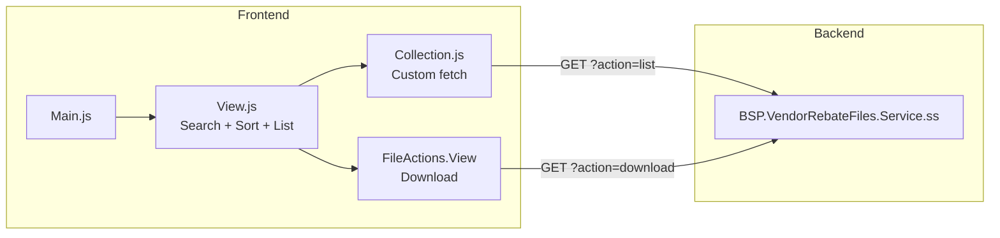

# VendorRebateFiles Extension

## Purpose

Provides vendors access to rebate template files. Vendors can browse, search, and download rebate templates that are managed by the organization. This is a read-only file listing (no upload capability).

## Key Responsibilities

- Display paginated list of rebate template files
- Search files by filename
- Sort files by filename
- Download individual rebate template files

## SuiteScript Version

- **Service endpoint:** SS1.0 (`services/BSP.VendorRebateFiles.Service.ss`)

## Entry Point

**File:** `Modules/Main/JavaScript/BSP.VendorRebateFiles.Main.js`

- **Vendor gate:** Checks `ProfileModel.getInstance().get('isVendor')` — exits if member
- **Menu:** Adds "Rebate Templates" under "File Processing" group (`fileprocessing`)
- **Route:** `rebate-templates`
- **Touchpoint:** myaccount

## Module Components

### Frontend

| Component | File | Role |
|-----------|------|------|
| **Main** | `BSP.VendorRebateFiles.Main.js` | Entry point, route + menu registration |
| **Model** | `BSP.VendorRebateFiles.Model.js` | Basic Backbone model |
| **Collection** | `BSP.VendorRebateFiles.Collection.js` | Custom jQuery.ajax fetch with search, sort, pagination |
| **View** | `BSP.VendorRebateFiles.View.js` | List view with search, sort, pagination |
| **FileActions.View** | `BSP.VendorRebateFiles.FileActions.View.js` | Per-row download action |

### Templates

| Template | Purpose |
|----------|---------|
| `bsp_vendorrebatefiles.tpl` | Main list view with search bar |
| `bsp_vendorrebatefiles_file_actions.tpl` | Download button per file row |

### Backend

| File | Type | Purpose |
|------|------|---------|
| `services/BSP.VendorRebateFiles.Service.ss` | SS1.0 | REST endpoint (action=list, search, download) |

## Data Flow

## Features Detail

### Search
- Text search by filename
- `searchFile()` fetches collection with search parameter
- `clearSearch()` resets to full listing

### Custom Fetch
- Uses `jQuery.ajax` instead of standard Backbone sync
- Supports parameters: `action`, `search`, `sort`, `order`, `page`, `results_per_page`
- Caching enabled (`cacheSupport: true`)

### Pagination
- Uses `GlobalViews.Pagination.View` and `GlobalViews.ShowingCurrent.View`
- `getPaginationInfo()` helper returns page, totalPages, total count

## Dependencies

- `Backbone`, `underscore`, `jQuery`
- `Profile.Model` (for isVendor check)
- `MyAccountMenu` (for menu registration via `addGroupEntry`)
- `GlobalViews.Pagination.View`, `GlobalViews.ShowingCurrent.View`
