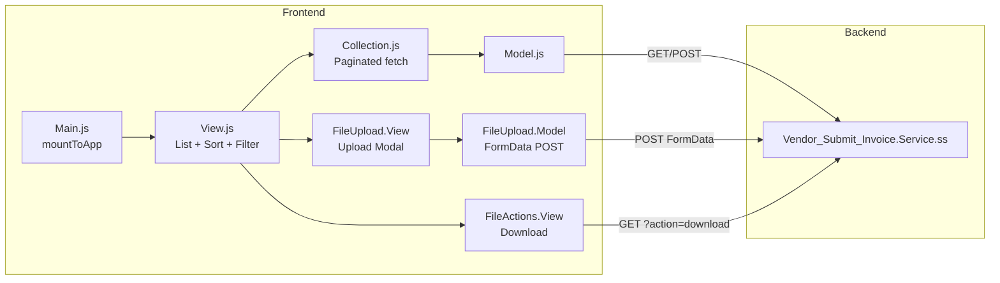

# Vendor_Submit_Invoice Extension

## Purpose

Allows vendors to upload, view, and download invoice files through the portal. Vendors can submit Excel files (.xlsx, .xls) as invoices with descriptions, track uploads by date, and download previously submitted files.

## Key Responsibilities

- Display paginated list of submitted invoice files with sorting and date filtering
- Upload invoice files (Excel format, max 10MB) via modal with progress tracking
- Download previously submitted invoice files
- Filter files by creation date range

## SuiteScript Version

- **Service endpoint:** SS1.0 (`services/Vendor_Submit_Invoice.Service.ss`)
- Uses `ServiceController.extend()` pattern

## Entry Point

**File:** `Modules/Main/JavaScript/Vendor_Submit_Invoice.Main.js`

- **Vendor gate:** Checks `ProfileModel.getInstance().get('isVendor')` — exits if member
- **Menu:** Adds "Submit Invoice" under "Supplier Info" group (index 3)
- **Route:** `submit-invoice`
- **Touchpoint:** myaccount (customercenter)

## Module Components

### Frontend

| Component | File | Role |
|-----------|------|------|
| **Main** | `Vendor_Submit_Invoice.Main.js` | Entry point, route + menu registration |
| **Model** | `BSP.Vendor_Submit_Invoice.Model.js` | Backbone model — urlRoot to Service.ss, `download()` method, validation |
| **Collection** | `BSP.Vendor_Submit_Invoice.Collection.js` | Paginated collection with date filtering, sort, order |
| **View** | `BSP.Vendor_Submit_Invoice.View.js` | Main list view — sorting, date filter, pagination, upload modal trigger |
| **FileActions.View** | `BSP.Vendor_Submit_Invoice.FileActions.View.js` | Per-row download action |
| **FileUpload.Model** | `BSP.Vendor_Submit_Invoice.FileUpload.Model.js` | Upload model — validates Excel files <= 10MB, FormData upload |
| **FileUpload.View** | `BSP.Vendor_Submit_Invoice.FileUpload.View.js` | Upload modal — file picker, description field, progress bar |

### Templates

| Template | Purpose |
|----------|---------|
| `vendor_submit_invoice.tpl` | Main list view |
| `vendor_submit_invoice_file_actions.tpl` | Download button per file row |
| `vendor_submit_invoice_file_upload.tpl` | Upload modal form |

### Backend

| File | Type | Purpose |
|------|------|---------|
| `services/Vendor_Submit_Invoice.Service.ss` | SS1.0 | REST endpoint for CRUD operations |

## Data Flow

## Features Detail

### File Upload
- Accepts `.xlsx` and `.xls` files only
- Maximum file size: 10MB
- Progress bar shown during upload
- Type is always set to `'invoice'`
- Collection auto-refreshes after successful upload

### File Listing
- Sortable by filename or created_date
- Date range filter (from/to)
- Paginated results (recordsPerPage configurable)

### File Download
- Creates temporary `<a>` element with download URL
- URL format: `service_url?action=download&id=<fileId>`

## Dependencies

- `Backbone`, `underscore`, `jQuery`
- `Profile.Model` (for isVendor check)
- `MyAccountMenu` (for menu registration)
- `GlobalViews.Pagination.View`, `GlobalViews.ShowingCurrent.View`
