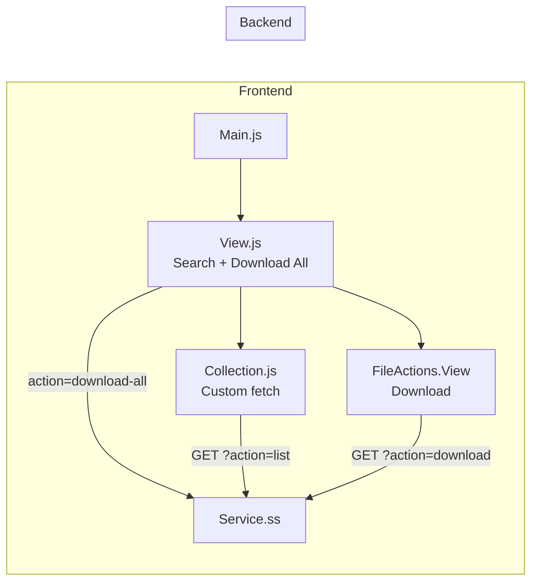

# Vendor_Tax_Certificates Extension

## Purpose

Provides vendors access to their tax certificate files. Vendors can browse, search, download individual certificates, or bulk-download all certificates as a ZIP archive.

## Key Responsibilities

- Display paginated list of tax certificate files
- Search certificates by filename
- Download individual certificate files
- Bulk download all certificates as a ZIP file

## SuiteScript Version

- **Service endpoint:** SS1.0 (`services/BSP.Vendor_Tax_Certificates.Service.ss`)

## Entry Point

**File:** `Modules/Main/JavaScript/BSP.Vendor_Tax_Certificates.Main.js`

- **Vendor gate:** Checks `ProfileModel.getInstance().get('isVendor')` — exits if member
- **Route:** `tax-certificates`
- **Touchpoint:** myaccount

## Module Components

### Frontend

| Component | File | Role |
|-----------|------|------|
| **Main** | `BSP.Vendor_Tax_Certificates.Main.js` | Entry point, route registration |
| **Model** | `BSP.Vendor_Tax_Certificates.Model.js` | Basic Backbone model |
| **Collection** | `BSP.Vendor_Tax_Certificates.Collection.js` | Custom fetch with search support |
| **View** | `BSP.Vendor_Tax_Certificates.View.js` | List view with search, download-all, pagination |
| **FileActions.View** | `BSP.Vendor_Tax_Certificates.FileActions.View.js` | Per-row download action |

### Templates

| Template | Purpose |
|----------|---------|
| `bsp_vendor_tax_certificates.tpl` | Main list view with search and download-all button |
| `bsp_vendor_tax_certificates_file_actions.tpl` | Download button per file row |

### Backend

| File | Type | Purpose |
|------|------|---------|
| `services/BSP.Vendor_Tax_Certificates.Service.ss` | SS1.0 | REST endpoint (list, download, download-all) |

## Data Flow

## Features Detail

### Bulk Download
- `downloadAll()` method on the View
- Calls service with `action=download-all`
- Returns ZIP archive of all certificates

### Search
- `searchFile()` and `clearSearch()` methods
- Filters files by filename via service parameter

### Custom Fetch
- Uses `jQuery.ajax` similar to VendorRebateFiles
- Caching enabled (`cacheSupport: true`)
- Supports search, sort, order, page, results_per_page parameters

## Dependencies

- `Backbone`, `underscore`, `jQuery`
- `Profile.Model` (for isVendor check)
- `GlobalViews.Pagination.View`, `GlobalViews.ShowingCurrent.View`
